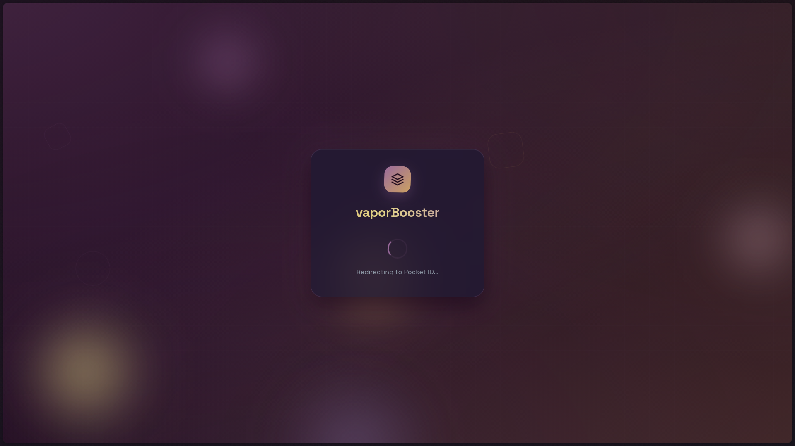
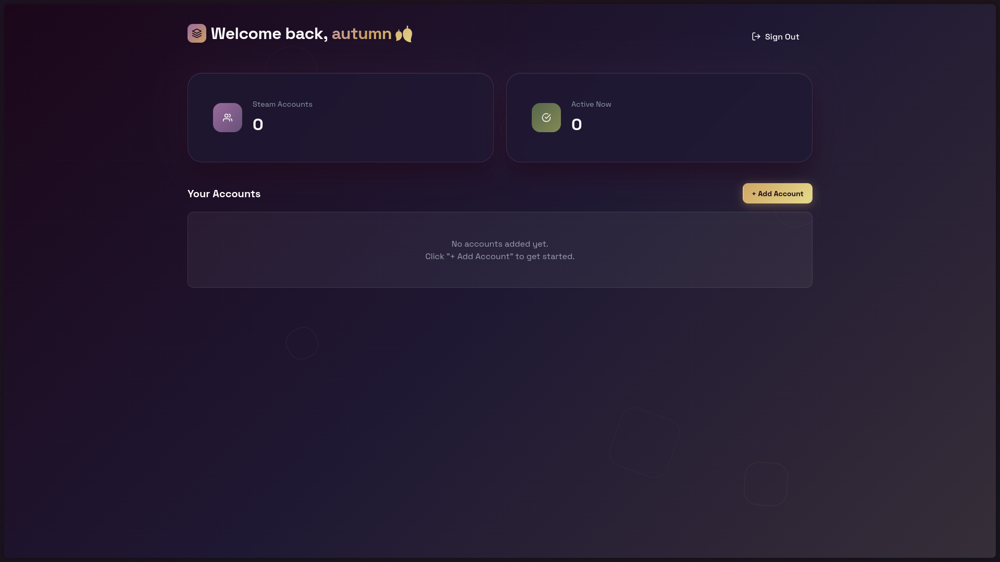
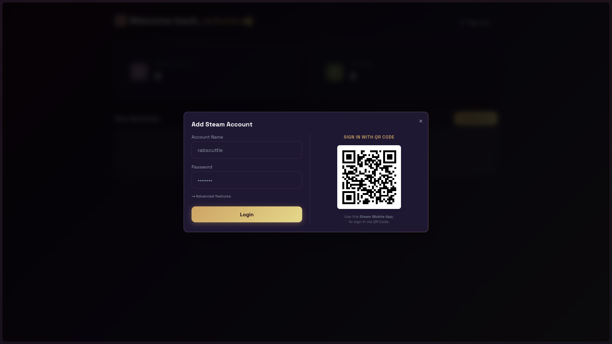
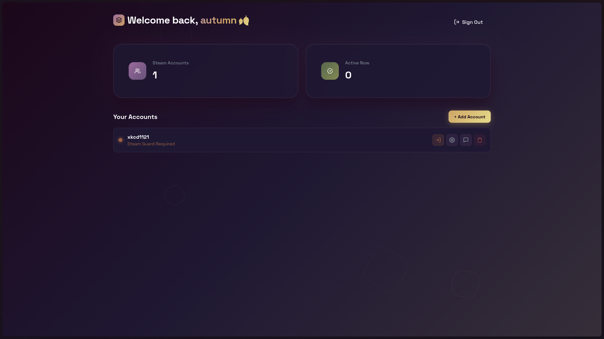
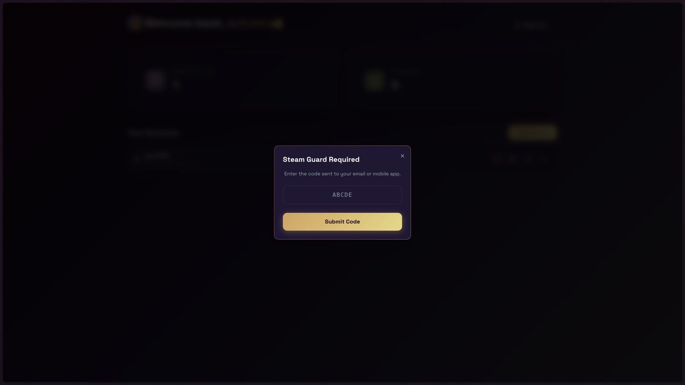
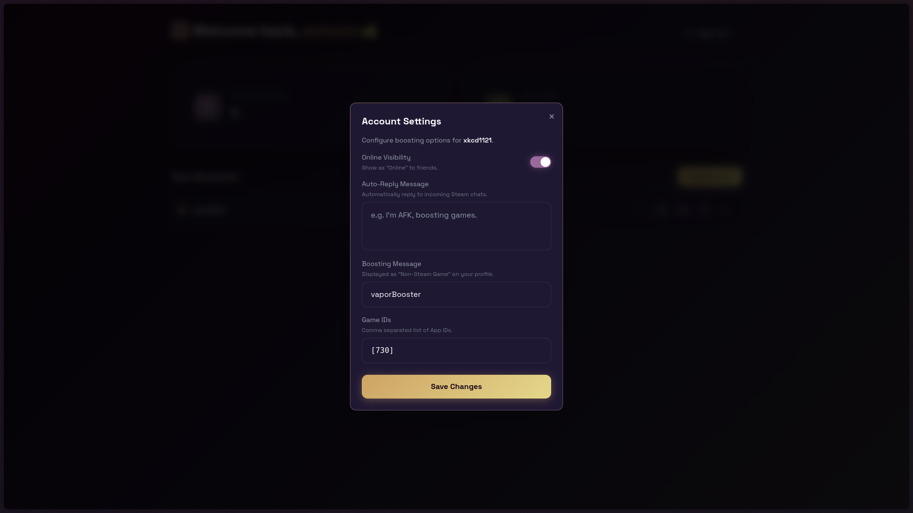
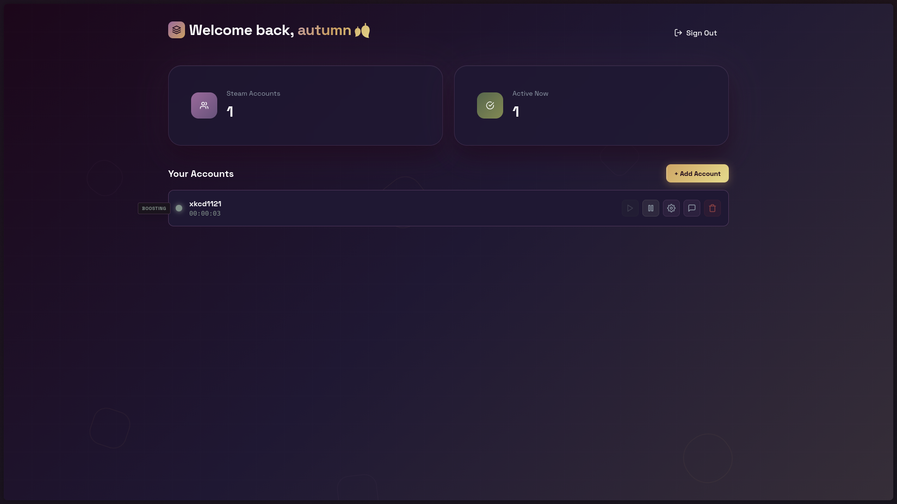
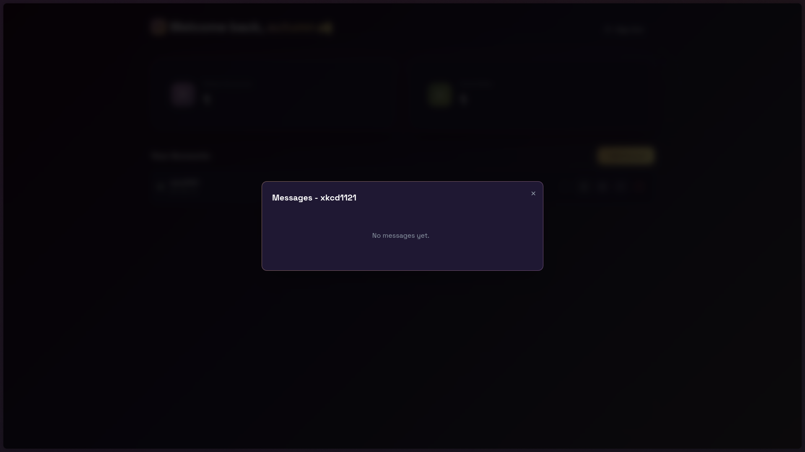
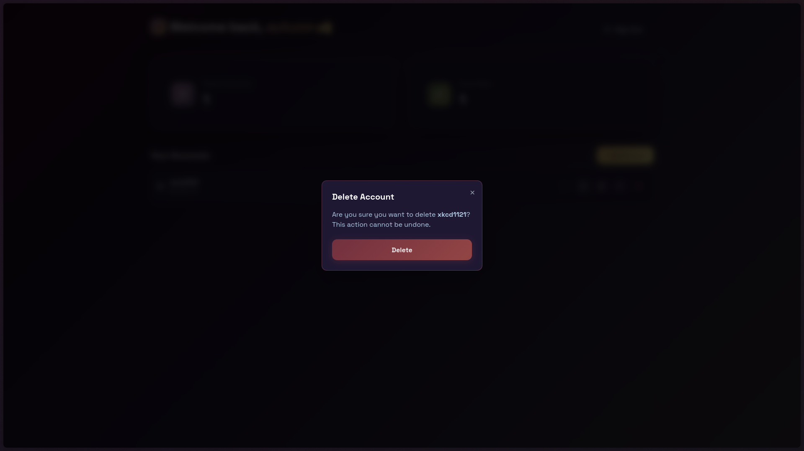

<div align="center">


# vaporBooster

### Simple, fast and reliable hour booster for the Steam platform.

[](https://www.docker.com/)
[](https://deno.land/)
[](https://svelte.dev/)
[](https://tailwindcss.com/)

</div>

---

## Screenshots

<div align="center">
  
  
  
  
  
  
  
  
  
</div>

---

## Deploy

### 1. Configure environment variables

Copy the example file and set the required variables:

```bash
cp .env.example .env
```

Generate a secure 32+ character secret for `BETTER_AUTH_SECRET`:

```bash
openssl rand -base64 32
```

Edit the `.env` file and paste the generated value:

```env
BETTER_AUTH_SECRET=<your_generated_secret>
```

### 2. Start with Docker Compose

```bash
docker compose up -d
```

### 3. Access the application

By default, the application will be available at: **http://localhost:8000**

---

## Authentication (Optional)

By default, the application **does not require authentication**. Anyone with access to the URL can use it.

### Configure an OIDC provider

If you want to add authentication, you can configure an OpenID Connect provider (such as [Keycloak](https://github.com/keycloak/keycloak), [Authentik](https://github.com/goauthentik/authentik), [Pocket ID](https://github.com/pocket-id/pocket-id), etc.) by adding the following variables to your `.env`:

```env
OIDC_PROVIDER_NAME=My Provider
OIDC_PROVIDER_ID=my-provider
OIDC_CLIENT_ID=your_client_id
OIDC_CLIENT_SECRET=your_client_secret
OIDC_DISCOVERY_URL=https://your-provider/.well-known/openid-configuration
```

> [!NOTE]
> If you don't configure an OIDC provider, the application will work without authentication.

---
